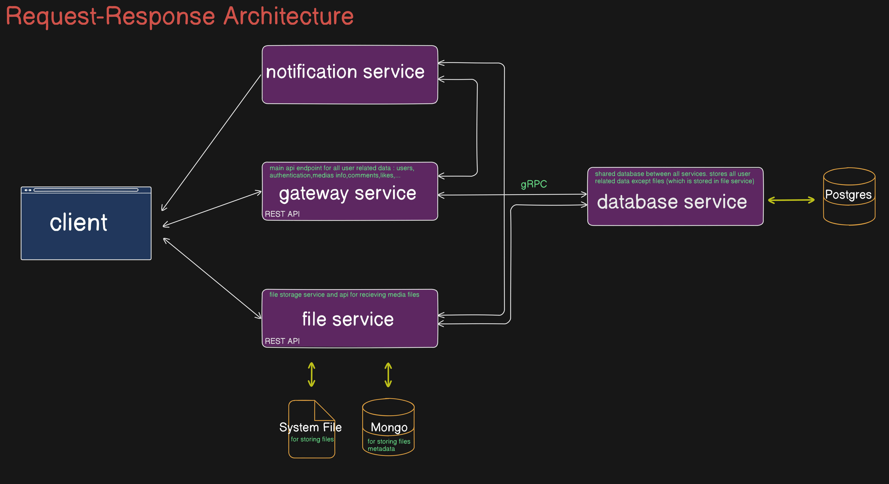

# youtube-clone

media storage and sharing api written in go using microservice architecture.

- for simplicity and data integrity used a central database for user related data except media files
- written in a request-response architecture
- services communicate to each other using gRPC

## services diagram



### gateway service

main api of app for user related data (users,medias,comments,playlists,likes,tags,followings)

### file service

- has an Rest api for recieving and uploading media files (photo,video,music)
- stores all media files and its meta data (other services communicate with file service to know media file url exist and belong to which user)
- media files are stored in system files and meta data is stored in a mongodb database
- handles video,music formating and compression (using ffmpeg)

### database service

- central database (postgres) for storing all user user related data (users,medias,comments,playlists,likes,tags,followings)
- other services communicate with database service to get user related data

### notification service

- recieves notificatoins from other services to send to user
- send emails to users for verifications,events,...

## api endpoints

protected routes require authentication with api key

### gateway service routes

#### USERS

| type |                 url                |protected|
|------|------------------------------------|-------|
| GET  |`api/users/{username}`              |&cross;|
| GET  |`api/users`                         |&cross;|
| GET  |`api/users/search/{term}`           |&cross;|
| POST |`api/users/`                        |&cross;|
| POST |`api/users/sign-in`                 |&cross;|
| POST |`api/users/{username}/verify/{code}`|&cross;|
| POST |`api/users/resend-email`            |&check;|
| PUT  |`api/users/{username}/profile-photo`|&check;|
| PUT  |`api/users/{username}/channel-photo`|&check;|
| PUT  |`api/users/{username}/newApiKey`    |&check;|
| PUT  |`api/users/{username}`              |&check;|
|DELETE|`api/users/{username}`              |&check;|
| POST |`api/follows/{username}`            |&check;|
|DELETE|`api/follows/{username}`            |&check;|

#### MEDIAS

| type |                 url                      |protected|
|------|------------------------------------------|-------|
| GET  |`api/medias`                              |&cross;|
| GET  |`api/medias/search/{term}`                |&cross;|
| GET  |`api/medias/{url}`                        |&cross;|
| POST |`api/medias`                              |&check;|
| PUT  |`api/medias/{url}`                        |&check;|
|DELETE|`api/medias/{url}`                        |&check;|
| POST |`api/medias/{url}/tag/{name}`             |&check;|
|DELETE|`api/medias/{url}/tag/{name}`             |&check;|
| POST |`api/medias/{url}/playlists/{playlistUrl}`|&check;|
| PUT  |`api/medias/{url}/playlists/{playlistUrl}`|&check;|
|DELETE|`api/medias/{url}/playlists/{playlistUrl}`|&check;|

#### COMMENTS

| type |                 url                      |protected|
|------|------------------------------------------|-------|
| GET  |`api/comments/{commentUrl}`               |&cross;|
| GET  |`api/comments/medias/{url}`               |&cross;|
| GET  |`/comments/{commentUrl}/replies`          |&cross;|
| POST |`api/comments/medias/{url}`               |&check;|
| PUT  |`api/comments/{commentUrl}`               |&check;|
|DELETE|`api/comments/{commentUrl}`               |&check;|

#### LIKES

| type |                 url                      |protected|
|------|------------------------------------------|-------|
| POST |`api/medias/{url}/likes`                  |&check;|
|DELETE|`api/medias/{url}/likes`                  |&check;|
| POST |`api/comments/{url}/likes`                |&check;|
|DELETE|`api/comments/{url}/likes`                |&check;|

#### PLAYLISTS

| type |                 url                      |protected|
|------|------------------------------------------|-------|
| GET  |`api/playlists`                           |&cross;|
| GET  |`api/playlists/search/{term}`             |&cross;|
| GET  |`api/playlists/{url}`                     |&cross;|
| GET  |`api/playlists/{url}/medias`              |&cross;|
| POST |`api/playlists`                           |&check;|
| PUT  |`api/playlists/{url}`                     |&check;|
|DELETE|`api/playlists/{url}`                     |&check;|

### file service routes

| type |        url         |protected|
|------|--------------------|-------|
| GET  |`api/photos/{url}`  |&cross;|
| GET  |`api/videos/{url}`  |&cross;|
| GET  |`api/musics/{url}`  |&cross;|
| POST |`api/photos/upload` |&check;|
| POST |`api/videos/upload` |&check;|
| POST |`api/musics/upload` |&check;|

## build

```make build``` builds go files\
```make all``` builds go files and generate pb files\
```make run``` builds everything and run docker container\
```make remove``` stops and removes docker container

## features

- video,music,photo sharing
- video and music streaming
- user subscribing (following)
- comment and reply on medias
- media and comment likes
- search in users,medias,playlists
- multi media playlists
- email verification
- user upload limit

## todo

- completing notifications
- image compression
- multiple video quality and bitrate
- video subtitle
- video thumbnail from video
- adding image to musics
